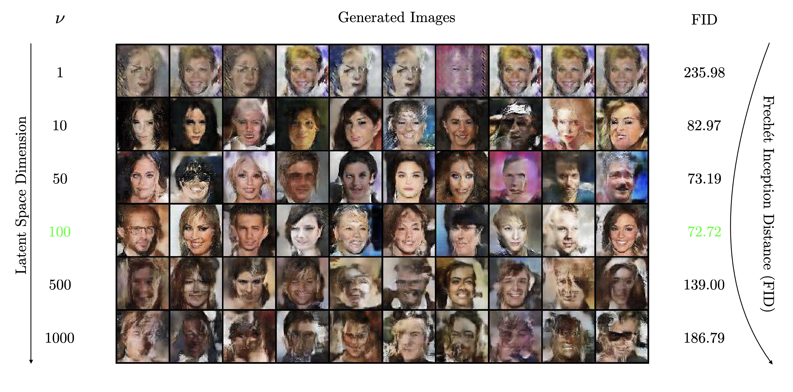
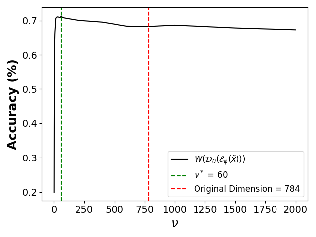
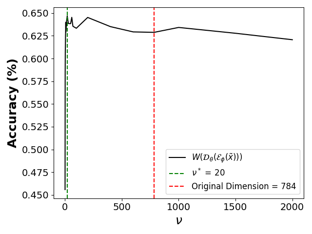

# Benign Autoencoders

```bib
@article{malamud2022benign,
  title={Benign Autoencoders},
  author={Malamud, Semyon and Schrimpf, Andreas and Xu, Teng Andrea and Matera, Giuseppe and Didisheim, Antoine},
  journal={arXiv preprint arXiv:2210.00637},
  year={2022}
}

```
-----------

## Abstract

Recent progress in Generative Artificial Intelligence (AI) relies on efficient data representations, often featuring encoder-decoder architectures. We formalize the mathematical problem of finding the optimal encoder-decoder pair and characterize its solution, which we name the "benign autoencoder" (BAE). We prove that BAE projects data onto a manifold whose dimension is the {\it optimal compressibility dimension} of the generative problem. 
We highlight surprising connections between BAE and several recent developments in AI, such as conditional GANs, context encoders, stable diffusion, stacked autoencoders, and the learning capabilities of generative models. As an illustration, we show how BAE can find optimal, low-dimensional latent representations that improve the performance of a discriminator under a distribution shift. By compressing "malignant" data dimensions, BAE leads to smoother and more stable gradients.

Many generative models are tightly linked to our theoretical framework, see Definition 1 in the [paper](https://arxiv.org/abs/2210.00637).

----------

## Experiments

The key testable implication of our theory is the existence of an optimal bottleneck (latent) dimension for the encoder: With too few latent dimensions, the model is not rich enough; with too many, it encodes malignant dimensions that hurt (or simply do not improve) performance: The encoded information ``saturates.''

------------

### Dependencies

- Pytorch 2.0
- [Pytorch FID](https://github.com/mseitzer/pytorch-fid)
- [Pytorch LPIPS](https://github.com/richzhang/PerceptualSimilarity)
- [CelebA-HQ/CelebA-MaskHQ](https://mmlab.ie.cuhk.edu.hk/projects/CelebA.html)
-----------

### 1. Distance Regularized GAN


```bash
python3 distance_regularized_gans/resize_celebA.py # Resize celebA 64 x 64
python3 distance_regularized_gans/main.py   # Train Models
python3 distance_regularized_gans/generate.py # FID
python3 distance_regularized_gans/grid_from_models.py # Figure 1
```



### 2. Context-Encoders

```bash
python3 context_encoders/main.py # Train Models
python3 context_encoders/evaluate.py # Generate In-painted images on test data
python3 context_encoders/lpips_2dirs.py # LPIPS
```


### 3. Evaluating the Quality of the Generator with a Discriminator

```bash
# Same for fmnist
python3 generator_quality/mnist/train_W.py # Train Discriminator
python3 generator_quality/mnist/train_bae.py # Train AE with Discriminator Penalty
python3 generator_quality/mnist/plot_class_baes.py # Plot
```

| <center>(a) MNIST</center> | <center>(b) FMNIST</center> | 
|-----------------------------------|-------------------------------------|

For the theoretical findings, we kindly direct the reader to the [paper](https://arxiv.org/abs/2210.00637). 