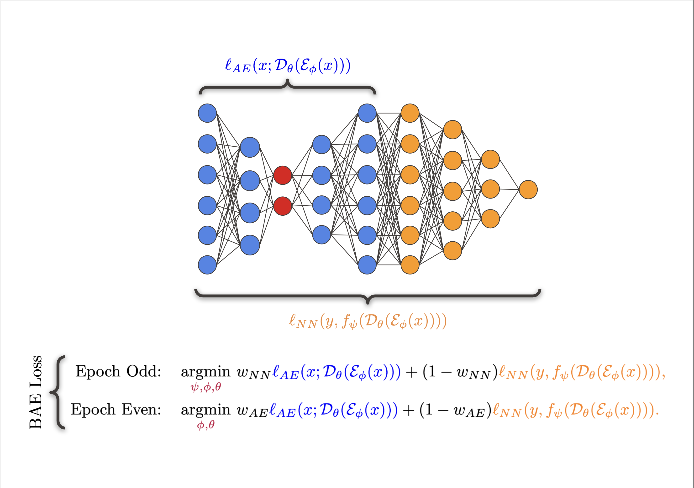

# Benign Autoencoders

Official (Tensorflow v2.9.1+) of "[Benign Autoencoders](https://arxiv.org/abs/2210.00637)" by [Semyon Malamud](https://www.epfl.ch/labs/sfi-sm/]), [Andreas Schrimpf](https://www.bis.org/author/andreas_schrimpf.htm), [Teng Andrea Xu](https://tengandreaxu.github.io/), [Giuseppe Matera](https://people.epfl.ch/giuseppe.matera), and [Antoine Didisheim](https://www.antoinedidisheim.com/).

```bib
@article{malamud2022benign,
  title={Benign Autoencoders},
  author={Malamud, Semyon and Schrimpf, Andreas and Xu, Teng Andrea and Matera, Giuseppe and Didisheim, Antoine},
  journal={arXiv preprint arXiv:2210.00637},
  year={2022}
}

```
-----------
## Abstract

Many recent breakthroughs in machine learning relied on novel algorithms for learning efficient representations: that is, the finding of a rich set of useful features in complex data. 
But while more and more innovations rest on representation learning, our fundamental understanding of this crucial concept is lagging behind.
In this work, we try to bridge that gap through a novel theory. We prove that every learning problem admits an optimal unbiased representation through features that live on a surface (manifold) we characterize. Replacing the input of a machine learning algorithm with its optimal representation always improves the algorithm's performance. We believe that our results open the door to new designs of learning algorithms in many areas of data science.

## Dependencies

- Python 3.7.3
- Tensorflow v2.9.1
- Pandas
- Numpy

## Train Models

```bash
./train_all.sh
```

## Benign Autoencoder Architecture

TL;DR In this [paper](https://arxiv.org/abs/2210.00637), we show that: *"When used as a preliminary step to a complex model, autoencoders should be trained in a
supervised, task-specific manner."* 



The figure above shows the implementation of the deterministic benign autoencoder described in Equation 9.

## Main Results

We consider three different datasets: A controlled simulated environment, MNIST, and FMNIST. The objective of these experiments is not to beat the *state of the art* performance on the real datasets, but rather to illustrate that, *ceteris paribus*, BAE+NN is superior to UAE+NN and plain NN in both regression and classification tasks. The two autoencoders (UAE and BAE) always share the same discriminator (NN) architecture. To reduce model performance sensitivity to random weights' initialization and random batches used in the stochastic gradient descent, we report the mean and standard deviation of the best model performance over 20 runs.

### MNIST

| Noise Factor | NN                | UAE+NN            | BAE+NN                     |
|-----------------------|-------------------|-------------------|----------------------------|
| 0.00                  | 0.976 $\pm$ 0.001 | 0.954 $\pm$ 0.004 | **0.985 $\pm$ 0.002** |
| 0.25                  | 0.955 $\pm$ 0.002 | 0.950 $\pm$ 0.007 | **0.977 $\pm$ 0.002** |
| 0.50                  | 0.900 $\pm$ 0.003 | 0.911 $\pm$ 0.007 | **0.946 $\pm$ 0.003** |
| 0.75                  | 0.815 $\pm$ 0.004 | 0.815 $\pm$ 0.014 | **0.868 $\pm$ 0.005** |

### FMNIST

| Noise Factor | NN                | UAE+NN            | BAE+NN                     |
|-----------------------|-------------------|-------------------|----------------------------|
| 0.00                  | 0.885 $\pm$ 0.001 | 0.872 $\pm$ 0.002 | **0.907 $\pm$ 0.002** |
| 0.25                  | 0.836 $\pm$ 0.003 | 0.847 $\pm$ 0.003 | **0.859 $\pm$ 0.003** |
| 0.50                  | 0.779 $\pm$ 0.003 | 0.791 $\pm$ 0.004 | **0.806 $\pm$ 0.002** |
| 0.75                  | 0.723 $\pm$ 0.004 | 0.728 $\pm$ 0.008 | **0.747 $\pm$ 0.003** |


For additional findings, we kidnly direct the reader to the [paper](https://arxiv.org/abs/2210.00637). 

-----------
## Acknowledgments

Parts of this paper were written when Malamud visited the Bank for International Settlements (BIS) as a research fellow. The views in this article are those of the authors and do not necessarily represent those of BIS. We are grateful for helpful comments from Peter Bossaerts, Michael Herzog, Jean-Pierre Eckmann. Semyon Malamud gratefully acknowledges financial support of the Swiss Finance Institute and the Swiss National Science Foundation, Grant 100018\_192692.